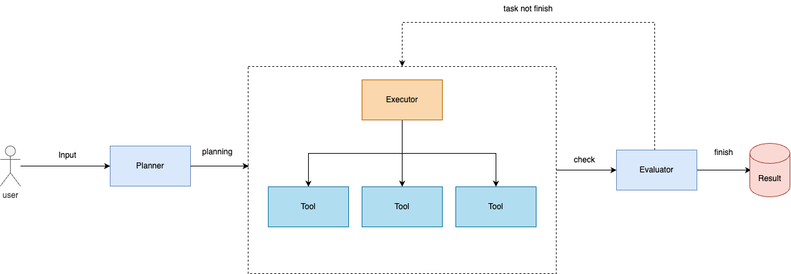

# 👋 Mercatus

An AI Agent Framework powered by OpenAI Agents SDK, inspired by Manus.



## About

Mercatus is an open-source AI agent framework built with OpenAI's Agents SDK. It aims to provide capabilities similar to Manus but without requiring an invite code. The framework leverages powerful tools like browser automation and Model Context Protocol (MCP) to enable sophisticated agent workflows.

## Features

- **AI Agent Architecture**: Plan-Execute-Evaluate workflow using OpenAI's Agents SDK
- **Browser Automation**: Use browser tools to interact with the web, collect data, and search for information
- **MCP Integration**: Use Model Context Protocol for sophisticated file operations
- **Modular Design**: Extensible architecture to add new tools and capabilities
- **User-Friendly Interface**: Simple command-line interface to interact with agents

## Installation

### Prerequisites

- Python 3.12+
- Node.js (for MCP tools)

### Setup

1. Clone the repository:

```bash
git clone https://github.com/yourusername/Mercatus.git
cd Mercatus
```

2. Create a virtual environment:

```bash
python -m venv venv
source venv/bin/activate  # On Windows: venv\Scripts\activate
```

3. Install dependencies:

```bash
pip install -r requirements.txt
```

4. Install browser automation tools (optional but recommended):

```bash
playwright install
```

5. Create a `.env` file with your API keys (copy from `.env.example`):

```bash
cp .env.example .env
```

Then edit `.env` to add your OpenAI API key.

## Usage

Run the main application:

```bash
python main.py
```

You will be prompted to enter your goal, and the AI agent will work on accomplishing it.

## Project Structure

```
app/
├── agents/         # Core AI agent logic
├── llm/            # LLM integration
├── mcps/           # MCP server definitions
├── prompts/        # Agent prompt templates
├── tools/          # Tools available to agents
│   ├── browser.py  # Browser automation tool
│   ├── file.py     # File operations via MCP
│   └── search.py   # Web search tool
└── types/          # Type definitions
```

## Architecture

The system follows a three-phase architecture:

1. **Planner**: Breaks down user goals into concrete tasks
2. **Executor**: Carries out individual tasks using available tools
3. **Evaluator**: Assesses task completion and quality

Each agent uses the OpenAI Agents SDK to manage context, tool selection, and execution.

## Available Tools

- **Browser Tool**: Automates browser interactions using the `browser-use` package
- **File Tool**: Manages file operations through MCP servers
- **Search Tool**: Enables web search capabilities

## Requirements

See `requirements.txt` for a complete list of dependencies, including:

- openai-agents==0.0.7
- browser-use==0.1.40 
- mcp==1.5.0
- playwright==1.51.0

## License

MIT

## Contributing

Contributions are welcome! Please feel free to submit a Pull Request.